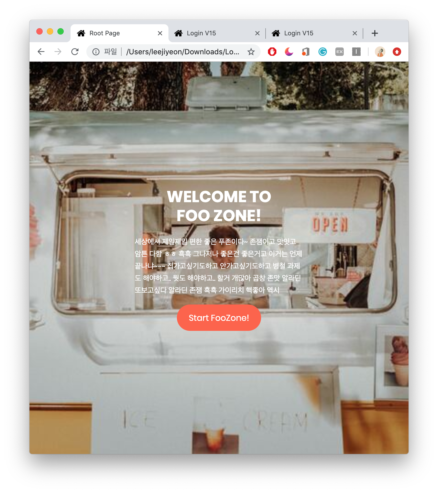
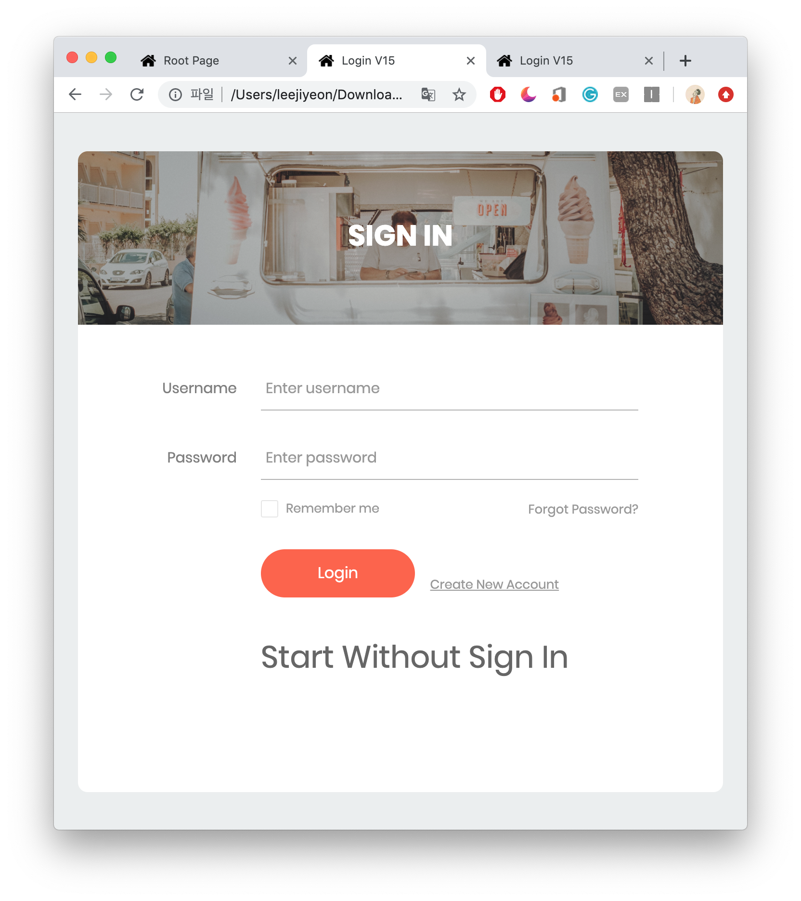
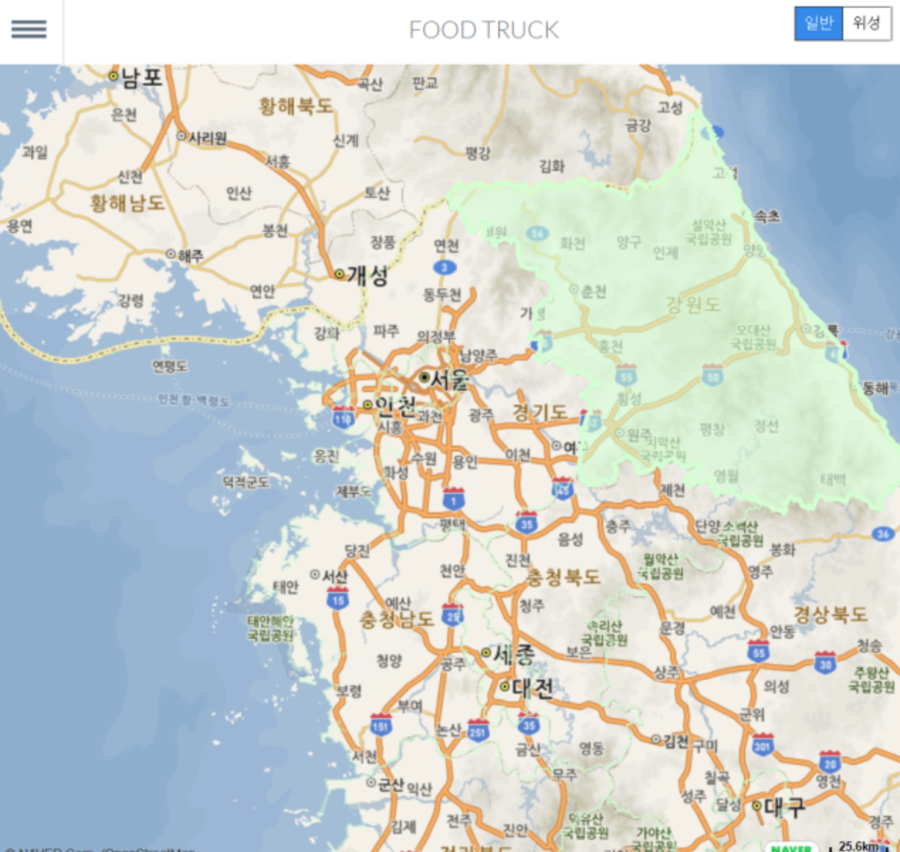
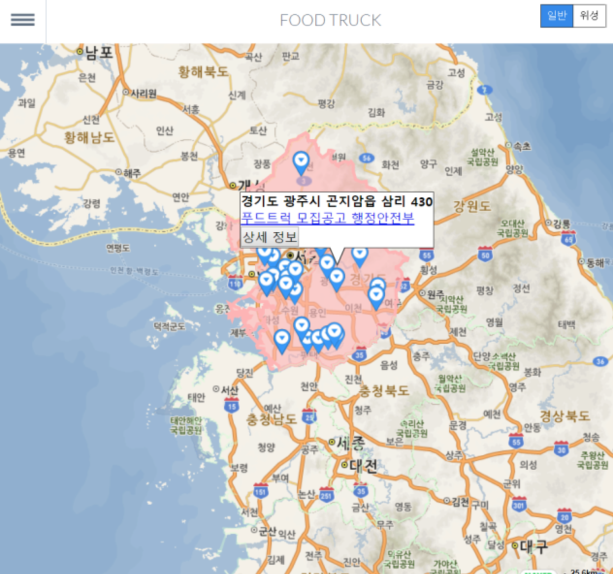
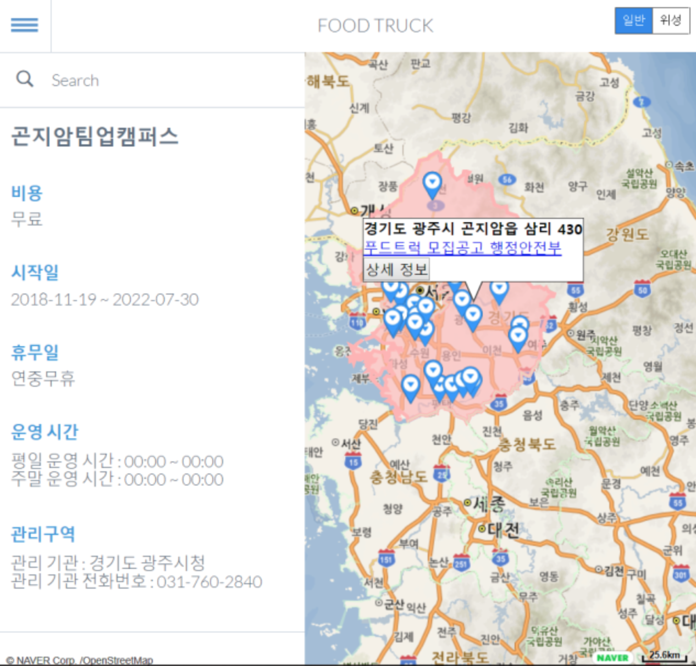

> 2019 DKU Hackathon project - EMOTE

# FOOZONE

푸드 트럭존을 지도에 알려주는 WEB application이다.

# Root Page & Login Page

|Root Page|Login Page|
|:-------:|:--------:|
||

이 디자인은 템플릿을 사용하여 구현하였다.

# Map Page

| contetn1 | content2 | content3 |
|:--:|:--:|:--:|
||||

네이버 지도 API를 통해 지도를 받아오고 푸드 트럭 허가 지역의 내용을 지도에 알려주었다.

# Reference
- 네이버 지도 API : <https://navermaps.github.io/maps.js/docs/index.html>
- 공공데이터포털 : <https://www.data.go.kr/>
